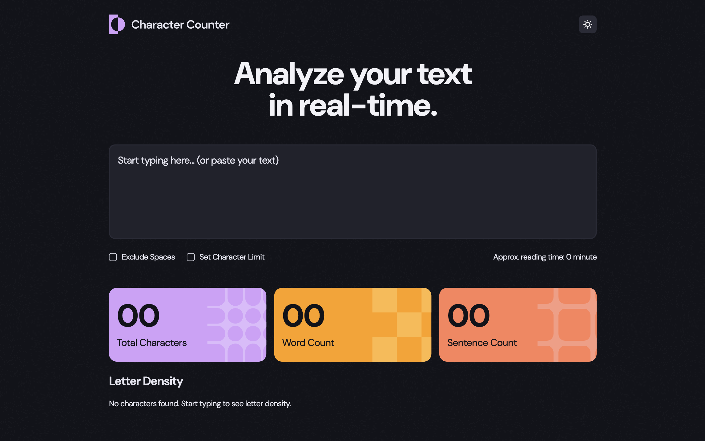
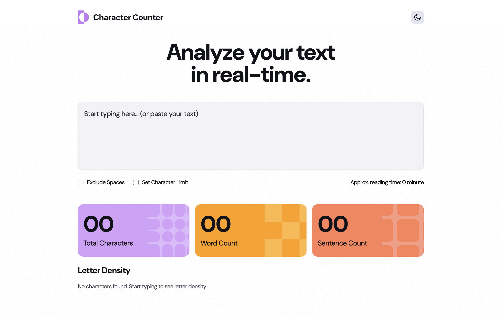

# Character Counter

## Table of contents

- [Overview](#overview)
  - [Screenshot](#screenshot)
  - [Links](#links)
- [My process](#my-process)
  - [Built with](#built-with)
- [Author](#author)

## Overview

### Screenshot

### Links

- Solution URL: [Solution URL](https://github.com/kisu-seo/character_counter)
- Live Site URL: [Live URL](https://kisu-seo.github.io/character_counter/)

## My process

### Built with

- **React 18** — Component-based UI built with functional components and hooks (`useState`, `useEffect`, `useMemo`) for real-time state management and performance optimization.
- **Vite** — Used as the build tool and development server for fast HMR and optimized production builds.
- **Tailwind CSS v3 (with custom config)** — All design tokens (colors, typography presets, spacing, border-radius) are centralized in `tailwind.config.js` using the `darkMode: 'class'` strategy for theme switching.
- **Semantic HTML5 Markup** — Structured with `<header>`, `<main>`, and `<section>` tags to create a meaningful and accessible document outline.
- **Mobile-First Responsive Design** — Built with a mobile-first workflow using Tailwind breakpoints (`md:`, `lg:`) so that stat cards stack vertically on mobile and align in a 3-column grid on wider screens.
- **Component Architecture** — The UI is split into four focused components (`Header`, `TextInputSection`, `StatCards`, `LetterDensity`) with all state owned by `App` and distributed via props.
- **Web Accessibility (A11y)**
  - `aria-label`, `aria-invalid`, `aria-live="polite"`, and `role="alert"` applied for screen reader support.
  - `aria-hidden="true"` on all decorative images and SVGs.
  - Keyboard-only focus ring implemented via a global `keydown`/`mousedown` detection pattern, as a cross-browser-consistent alternative to `:focus-visible`.
- **Google Fonts** — Integrated `DM Sans` for all text to match the design specification.

## Author

- Website - [Kisu Seo](https://github.com/kisu-seo)
- Frontend Mentor - [@kisu-seo](https://www.frontendmentor.io/profile/kisu-seo)
